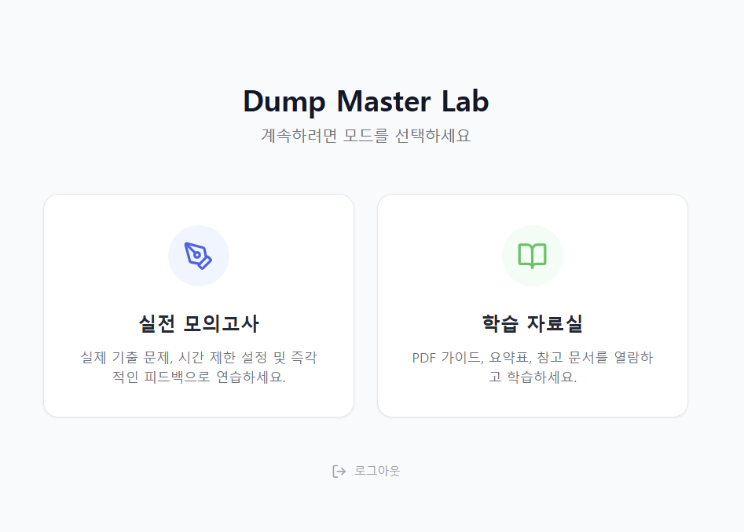
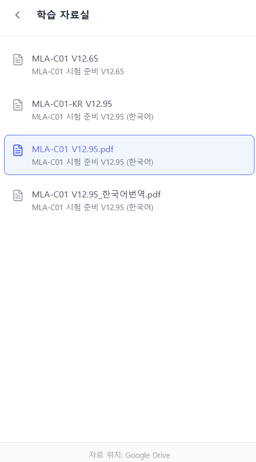
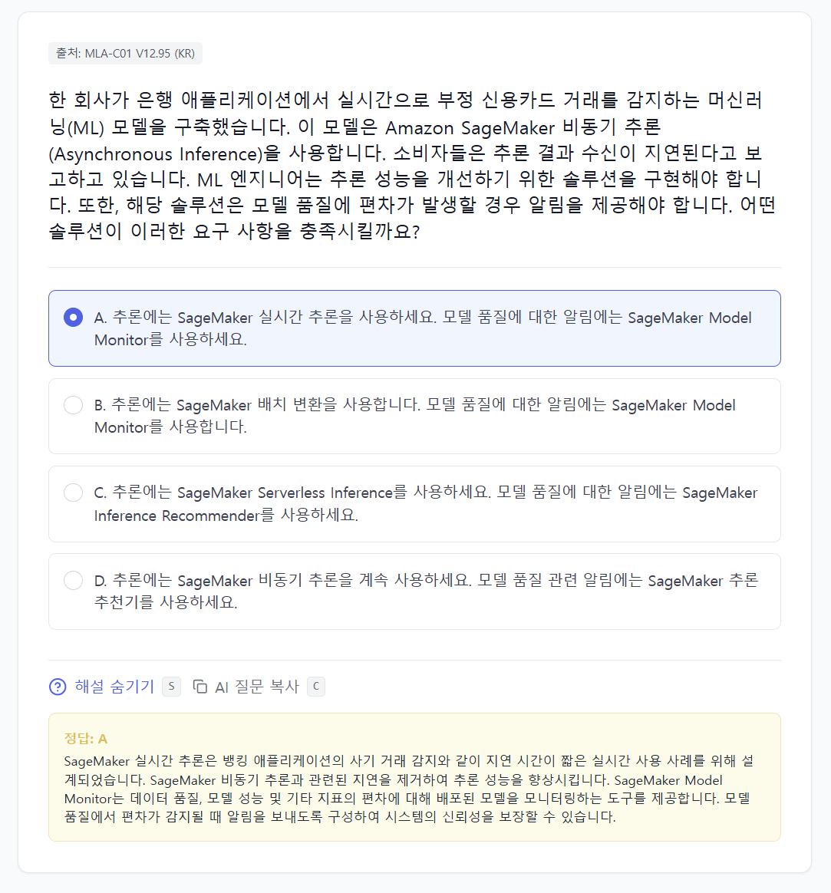
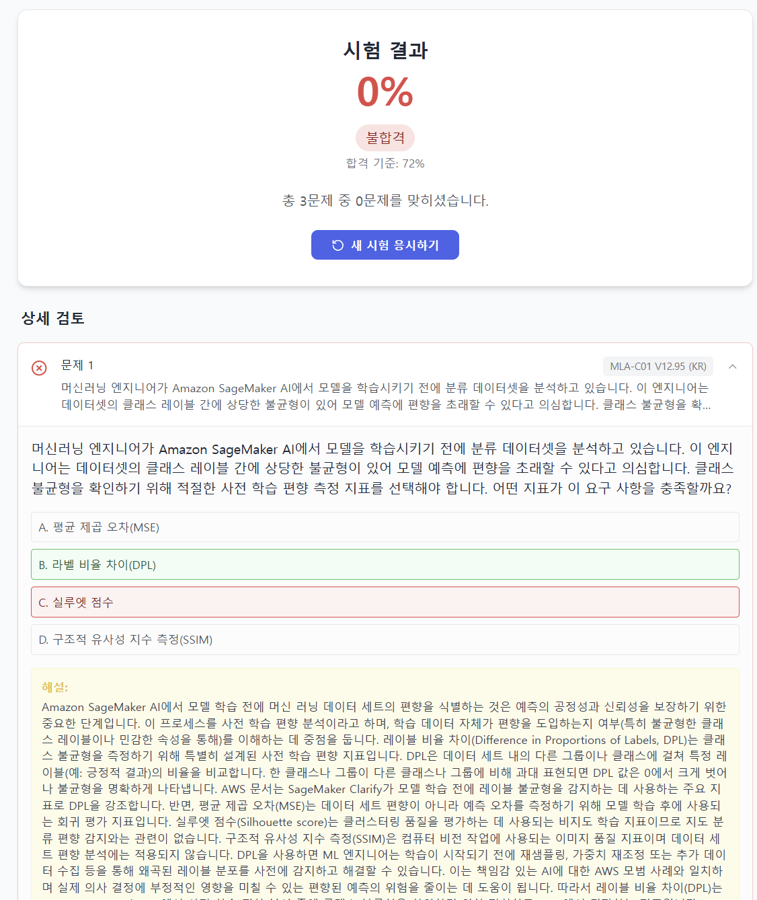

# Dump Master Lab

덤프파일을 기반으로 문제 은행 및 학습자료를 제공하는 서비스입니다. 데이터 보안을 위해 **AES 암호화**를 적용하여 원본 데이터 유출을 방지합니다.

## 📱 서비스 미리보기 (Service Preview)

| 메인 화면 | PDF 학습 자료 뷰어 |
| :---: | :---: |
|  |  |

| 퀴즈 풀이 화면 1 | 퀴즈 풀이 화면 2 |
| :---: | :---: |
|  |  |

| 결과 분석 화면 1 | 결과 분석 화면 2 |
| :---: | :---: |
|  |  |

| 설정 화면 1 | 설정 화면 2 |
| :---: | :---: |
|  |  |


## 🛠️ 초기 설정 (Configuration)

이 프로젝트는 `.env` 파일을 통해 보안 키를 안전하게 관리합니다.

### 1. 환경 변수 설정 (.env)
프로젝트 루트에 `.env` 파일을 생성하고( `.env.sample` 참고), 아래와 같이 암호화 키를 설정하세요.
```env
VITE_DATA_ENCRYPTION_KEY=your-secret-key-here
```
* **주의**: 이 키는 `encrypt-dumps.js`(암호화)와 `App.tsx`(복호화) 양쪽에서 사용됩니다.

### 2. 로그인 비밀번호 설정
`config.ts` 파일에서 로그인 검증을 위한 해시값을 설정합니다.
1. `hash-generator.html` 파일을 브라우저로 엽니다.
2. `.env`에 설정한 비밀번호(예: `your-secret-key-here`)를 입력하여 SHA-256 해시를 생성합니다.
3. `config.ts`의 `VIP_PASSWORD_HASH` 값을 생성된 해시값으로 교체합니다.

## 🔐 데이터 관리 및 암호화 (Data Workflow)

보안을 위해 **원본 데이터**는 Git에 올리지 않고, **암호화된 데이터**만 배포합니다.

* **`unencrypted-dumps/`**: (GitIgnored) 원본 JSON 문제 파일이 위치하는 로컬 폴더입니다.
* **`dump/`**: (Public) 앱이 실제로 불러오는 암호화된 JSON 파일 폴더입니다.

### 문제 추가 및 업데이트 방법
1. **`unencrypted-dumps/` 폴더**에 새로운 문제 파일(JSON)을 넣거나 수정합니다.
2. 터미널에서 다음 스크립트를 실행합니다.
   ```bash
   node encrypt-dumps.js
   ```
3. 스크립트가 `unencrypted-dumps/`의 내용을 암호화하여 `dump/` 폴더를 자동으로 갱신(덮어쓰기)합니다.
4. **`services/dataService.tsx`**에 해당 파일 정보를 등록하여 앱에 표시되도록 합니다.

> **Note**: `sample_questions.json`은 공개용이므로 암호화되지 않고 그대로 복사됩니다.
> **Note**: `MLA-C01-100Q-by-Gemini.json`은 공개용이지만 암호화하였습니다.

## 🚀 실행 방법 (Getting Started)

1. **의존성 설치**
   ```bash
   npm install
   ```

2. **개발 서버 실행**
   ```bash
   npm run dev
   ```
   브라우저에서 `http://localhost:8080/` 접속하여 확인.

## 🔐 접근 권한 (Access Tiers)

* **VIP 회원**: 프리미엄 비밀번호로 로그인하며, 모든 문제 은행에 제한 없이 접근 가능합니다.
* **일반 회원**: 일반 비밀번호로 로그인하며, 각 덤프의 **5문제 미리보기**만 가능합니다.
* **Guest (체험하기)**: 비밀번호 없이 체험판 문제(`sample_questions.json`)만 이용 가능합니다.
