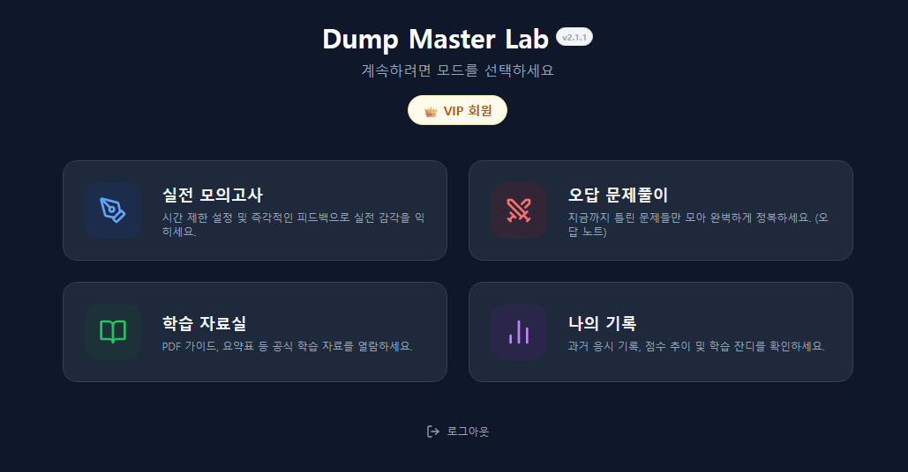
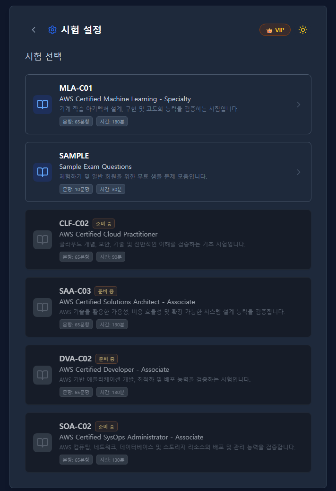
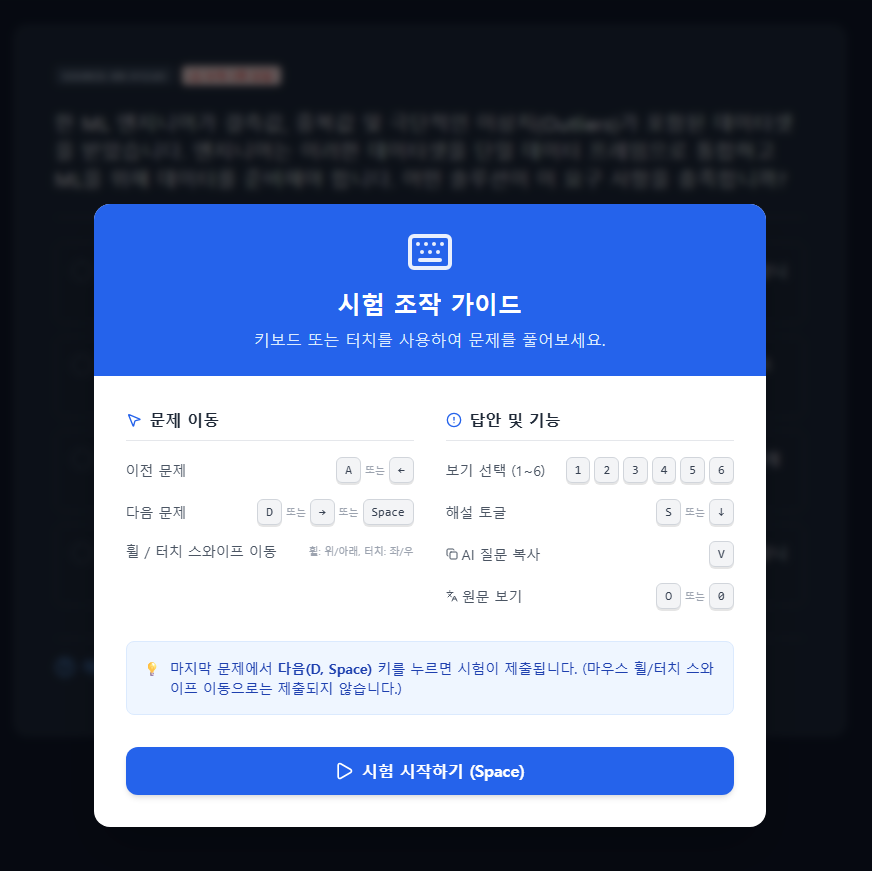
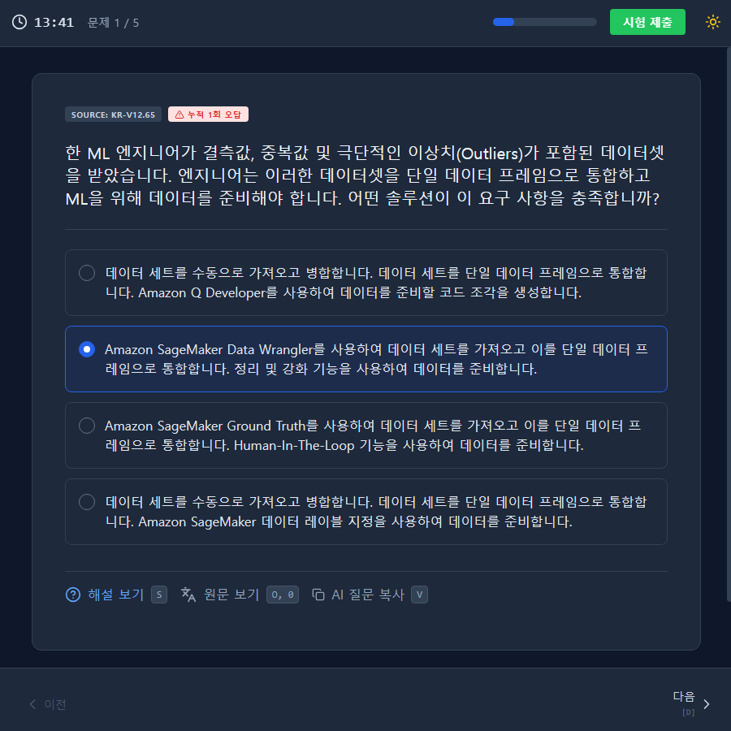
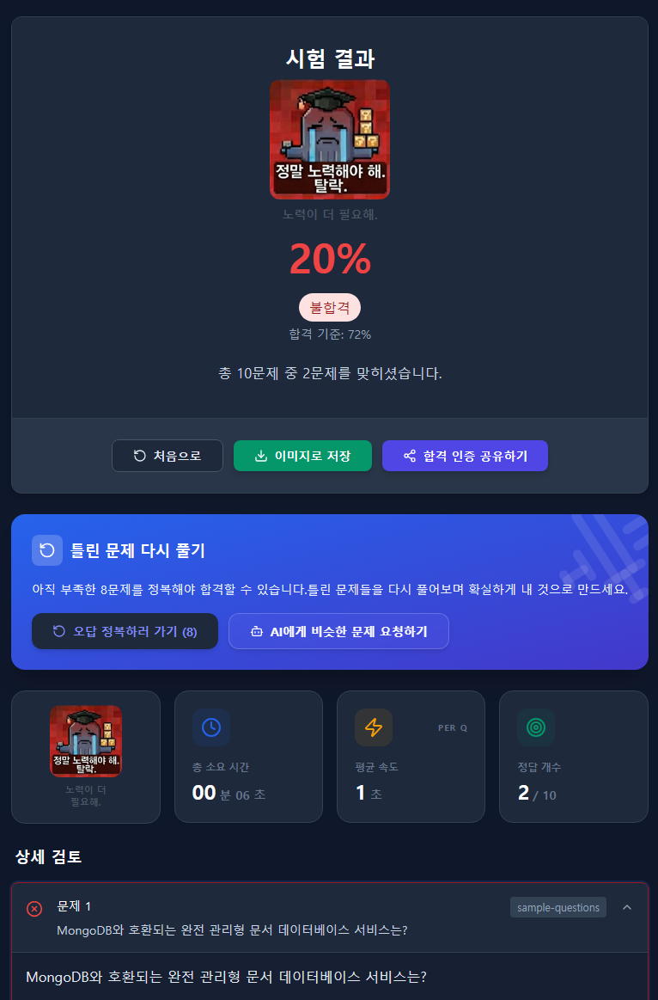
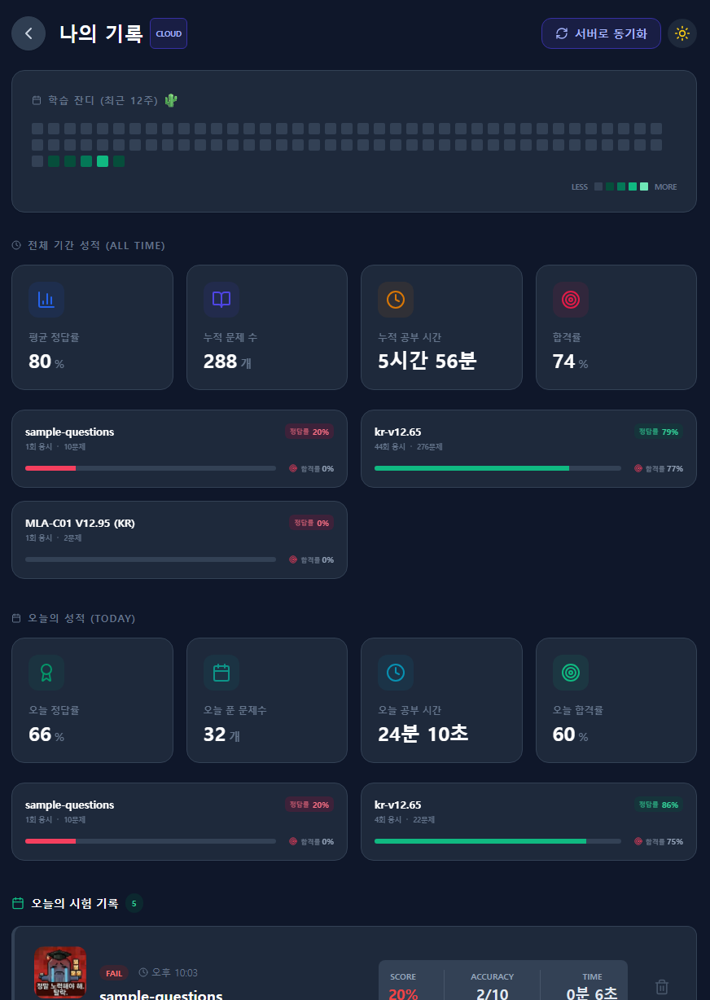
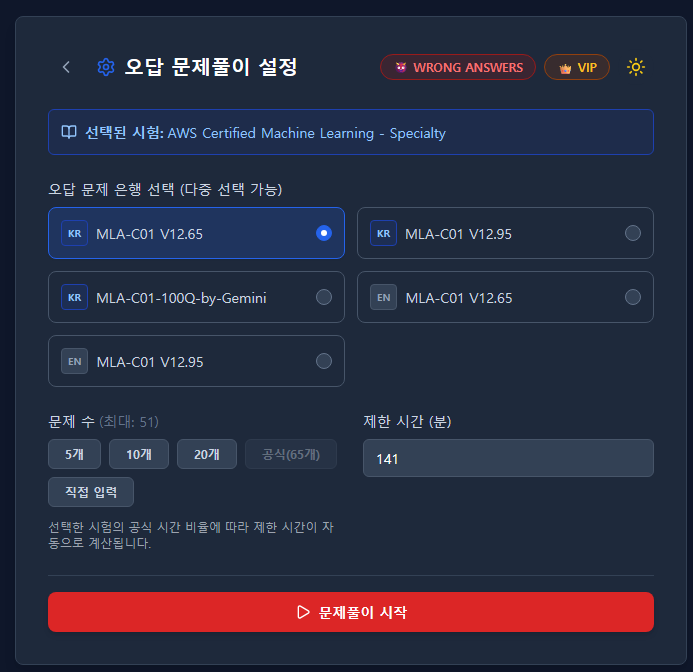

# Dump Master Lab

🔗 **Test Site**: [Check it out here!](https://dump-master-lab-service-634513499013.asia-northeast3.run.app/)

덤프파일을 기반으로 문제 은행 및 학습자료를 제공하는 서비스입니다. 데이터 보안을 위해 **AES 암호화**를 적용하여 원본 데이터 유출을 방지합니다.

## ✨ 주요 기능 (Key Features)

- **보안 중심 데이터 관리**: AES-256 암호화를 통해 문제 유출을 방지하며, 클라이언트 사이드 복호화로 빠른 응답성을 제공합니다.
- **다양한 응시 모드**:
    - **실전 모의고사**: 랜덤 문항 추출 및 시간 제한 설정을 통한 실전 연습.
    - **오답 문제풀이**: 틀린 문제만 모아 집중적으로 공략하는 오답 노트 모드.
    - **학습 자료실**: 관련 PDF 문서를 내장 뷰어로 직접 열람 (VIP 전용).
- **스마트한 문제 풀이**:
    - **복수 정답 지원**: 선택지가 여러 개인 문제를 완벽하게 지원하며 정답 개수 힌트를 제공합니다.
    - **즉시 피드백**: 문제 풀이 직후 정답과 해설을 확인할 수 있습니다.
- **학습 이력 관리**:
    - **나의 기록**: 과거 응시 점수, 소요 시간, 합격 여부 추이를 시각적으로 확인합니다.
    - **클라우드 동기화**: Firebase를 통해 여러 기기에서 학습 이력을 실시간으로 동기화합니다.
- **UX 최적화**:
    - 키보드 숏컷 지원 (A:이전, D:다음, S:해설, C:설명복사 등).
    - 모바일 반응형 디자인 및 터치 스와이프 제스처 지원.

## 🏗️ 아키텍처 (Architecture)

이 프로젝트는 **Feature-Sliced Design (FSD)** 아키텍처를 도입하여 유지보수성과 확장성을 강화했습니다.

### 📂 폴더 구조 (Folder Structure)

```bash
src/
├── app/          # 애플리케이션 진입점 및 전역 설정 (App.tsx, Routing)
├── pages/        # 라우팅 단위 페이지 (Login, Menu, Quiz, Result 등)
├── widgets/      # 페이지를 구성하는 독립적인 UI 블록 (Header, Footer 등)
├── features/     # 사용자 인터랙션이 포함된 기능 모듈 (Auth, QuizSession 등)
├── entities/     # 비즈니스 데이터 모델 및 UI (Question, HistoryRecord 등)
└── shared/       # 프로젝트 전반에서 공유되는 재사용 가능한 코드
    ├── api/      # 백엔드 API 호출 및 데이터 서비스 (Firebase, DataService)
    ├── config/   # 전역 상수 및 환경 설정
    ├── lib/      # 공통 유틸리티 함수
    ├── model/    # 공통 타입 정의 (TypeScript Interfaces)
    └── ui/       # 공통 UI 컴포넌트 (Button, Input, ThemeToggle)
```

## 🚀 Future Plan (TODO)

* **보안 강화**: 프론트엔드와 백엔드 서비스 분리
    * 암호화 키 관리 및 데이터 복호화 로직을 서버 사이드로 이동하여 보안성을 높일 예정입니다.

## 🛠️ 기술 스택 (Tech Stack)

### 1. Frontend
- **Framework**: [React 19](https://react.dev/)
- **Language**: [TypeScript](https://www.typescriptlang.org/)
- **Build Tool**: [Vite](https://vitejs.dev/)
- **Styling**: [Tailwind CSS](https://tailwindcss.com/)
- **Icons**: [Lucide React](https://lucide.dev/)

### 2. Backend & Data
- **BaaS**: [Firebase](https://firebase.google.com/) (Authentication, Firestore)
- **Security**: [Crypto-js](https://github.com/brix/crypto-js) (AES-256 Data Encryption)

### 3. Client Features
- **PDF Viewer**: Google Drive Embed (Iframe based)
- **Image Generation**: [html-to-image](https://github.com/bubkoo/html-to-image) (성적표 이미지 공유)

### 4. Infrastructure & DevOps
- **Containerization**: Docker
- **CI/CD**: Google Cloud Build
- **Storage**: Google Cloud Storage (GCS)
- **Hosting**: Google Cloud Run / Firebase Hosting


## ☁️ 자동화 스크립트 가이드 (Automation Scripts)

개발 생산성을 위해 데이터 암호화 및 클라우드 백업을 위한 자동화 스크립트를 제공합니다.

### 1. 데이터 암호화 (`encrypt-dumps.js`)
원본 JSON 문제 파일을 AES-256으로 암호화하여 배포 가능한 형태로 변환합니다.

* **입력 폴더**: `unencrypted-dumps/` (GitIgnored)
* **출력 폴더**: `public/dump/` (Public Assets)

```bash
# 사용법
node encrypt-dumps.js
```
> 실행 시 `unencrypted-dumps/` 폴더 내의 `.json` 파일들을 읽어 암호화한 뒤 `public/dump/` 폴더로 저장합니다.

### 2. 클라우드 백업 관리 (`gcs_handler.py`)
핵심 설정 파일과 데이터를 Google Cloud Storage(GCS)에 백업하고 복구합니다. FSD 구조에 맞춰 `src/shared/config`, `src/shared/api`, `public/dump` 등을 관리합니다.

* **사전 준비**: `pip install google-cloud-storage python-dotenv` 설치 및 `gcp-key.json`, `.env` 설정 필요.

```bash
# 전체 백업 (Upload All)
# .env, config, api 서비스, 덤프 데이터 등을 GCS 버킷으로 업로드
py gcs_handler.py upload-all

# 전체 복구 (Download All)
# GCS 버킷의 모든 데이터를 로컬 tmp/download/ 폴더로 다운로드
py gcs_handler.py download-all

# 개별 파일 업로드
py gcs_handler.py upload <로컬경로> <버킷저장경로>
# 예: py gcs_handler.py upload public/dump/data.json public/dump/data.json
```

## 🔐 데이터 관리 워크플로우

1. **문제 추가**: `unencrypted-dumps/`에 원본 JSON 파일 추가.
2. **암호화**: `node encrypt-dumps.js` 실행 -> `public/dump/`에 암호화 파일 생성.
3. **설정 등록**: `src/shared/api/dataService.tsx`에 데이터 소스 정보 추가.
4. **배포/백업**: `py gcs_handler.py upload-all`로 GCS에 백업하거나, 변경 사항을 Git에 커밋하여 CI/CD 트리거.

## 🛠️ 초기 설정 (Configuration)

### 1. 환경 변수 설정 (.env)
프로젝트 루트에 `.env` 파일을 생성하고( `.env.sample` 참고), 아래 정보를 설정하세요.
```env
# 데이터 복호화 키
VITE_DATA_ENCRYPTION_KEY=your-secret-key-here

# Firebase 설정 (Cloud 모드 사용 시 필수)
VITE_FIREBASE_API_KEY=...
# ... 기타 Firebase 설정

# 저장 모드 설정: LOCAL / CLOUD
VITE_STORAGE_MODE=CLOUD
```

### 2. 로그인 비밀번호 설정 (`src/shared/config/index.ts`)
1. `public/hash-generator.html` 파일을 브라우저로 엽니다.
2. 비밀번호를 입력하여 SHA-256 해시를 생성합니다.
3. `src/shared/config/index.ts` 파일의 `VIP_PASSWORD_HASH` 값을 생성된 해시값으로 교체합니다.

## 🚀 실행 방법 (Getting Started)

1. **의존성 설치**
   ```bash
   npm install
   ```

2. **개발 서버 실행**
   ```bash
   npm run dev
   ```
   브라우저에서 `http://localhost:8080/` 접속하여 확인.

## 🔐 접근 권한 (Access Tiers)

* **VIP 회원**: 프리미엄 비밀번호로 로그인하며, 모든 문제 은행에 제한 없이 접근 가능합니다.
* **일반 회원**: 일반 비밀번호로 로그인하며, 각 덤프의 **5문제 미리보기**만 가능합니다.

## 📱 서비스 미리보기 (Service Preview)

| 메인 대시보드 | 상세 설정 |
| :---: | :---: |
|  |  |

| 퀴즈 풀이 | 답안 확인 및 해설 |
| :---: | :---: |
|  |  |

| 결과 분석 1 | 결과 분석 2 |
| :---: | :---: |
|  |  |

| 히스토리 관리 | 오답 다시 풀기 |
| :---: | :---: |
|  |  |
