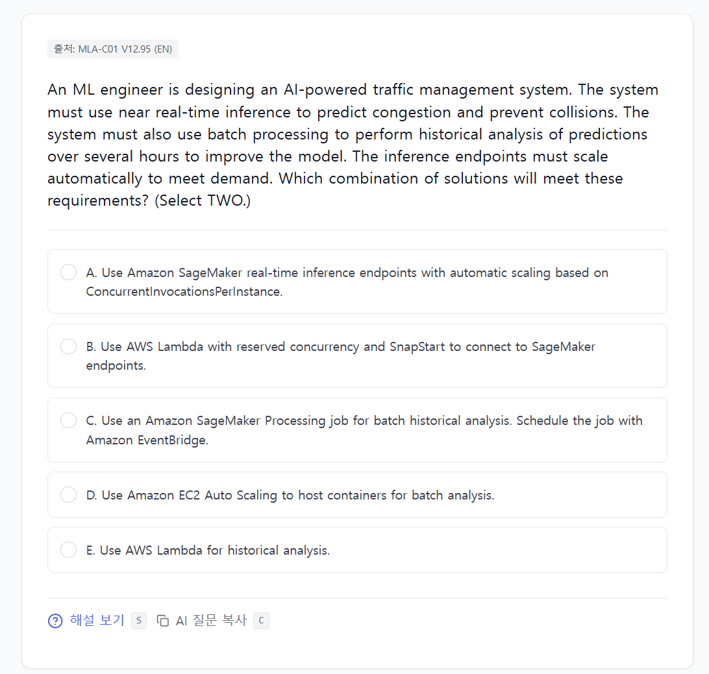
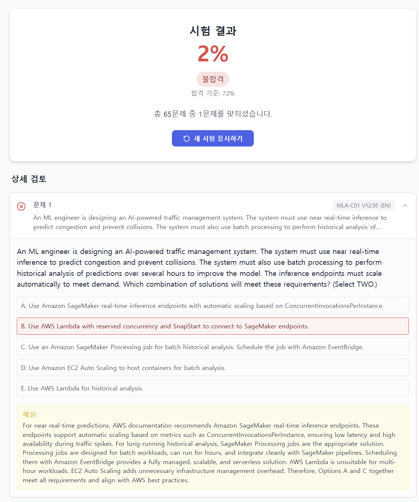
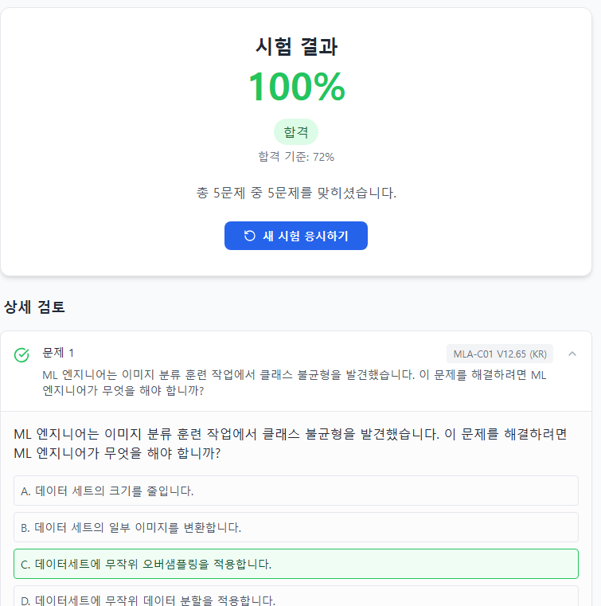
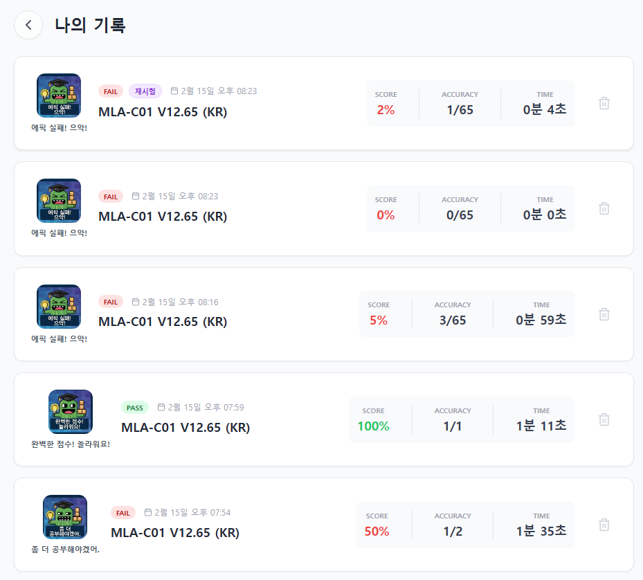

# Dump Master Lab

🔗 **Test Site**: [Check it out here!](https://dump-master-lab-service-634513499013.asia-northeast3.run.app/)

덤프파일을 기반으로 문제 은행 및 학습자료를 제공하는 서비스입니다. 데이터 보안을 위해 **AES 암호화**를 적용하여 원본 데이터 유출을 방지합니다.

## ✨ 주요 기능 (Key Features)

- **보안 중심 데이터 관리**: AES-256 암호화를 통해 문제 유출을 방지하며, 클라이언트 사이드 복호화로 빠른 응답성을 제공합니다.
- **다양한 응시 모드**:
    - **실전 모의고사**: 랜덤 문항 추출 및 시간 제한 설정을 통한 실전 연습.
    - **학습 자료실**: 관련 PDF 문서를 내장 뷰어로 직접 열람 (VIP 전용).
- **스마트한 문제 풀이**:
    - **복수 정답 지원**: 선택지가 여러 개인 문제를 완벽하게 지원하며 정답 개수 힌트를 제공합니다.
    - **틀린 문제 다시 풀기**: 시험 종료 후 오답만 모아 즉시 재응시할 수 있습니다.
- **학습 이력 관리**:
    - 로컬 스토리지 기반의 **나의 기록** 기능을 통해 과거 응시 점수, 소요 시간, 합격 여부 추이를 확인합니다.
- **UX 최적화**:
    - 키보드 숏컷 지원 (A:이전, D:다음, S:해설, C:설명복사 등).
    - 모바일 반응형 디자인 및 몰입형 풀스크린 뷰어.


## 📱 서비스 미리보기 (Service Preview)

| 메인 화면 | PDF 학습 자료 뷰어 |
| :---: | :---: |
|  |  |

| 퀴즈 풀이 화면 1 | 퀴즈 풀이 화면 2 |
| :---: | :---: |
|  |  |

| 결과 분석 화면 1 | 결과 분석 화면 2 |
| :---: | :---: |
|  |  |

| 설정 화면 1 | 설정 화면 2 |
| :---: | :---: |
|  |  |

| 나의 기록 화면 |
| :---: |
|  |


## 🛠️ 초기 설정 (Configuration)

이 프로젝트는 `.env` 파일을 통해 보안 키를 안전하게 관리합니다.

### 1. 환경 변수 설정 (.env)
프로젝트 루트에 `.env` 파일을 생성하고( `.env.sample` 참고), 아래 정보를 설정하세요.
```env
# 데이터 복호화 키
VITE_DATA_ENCRYPTION_KEY=your-secret-key-here

# Firebase 설정 (Cloud 모드 사용 시 필수)
VITE_FIREBASE_API_KEY=...
VITE_FIREBASE_PROJECT_ID=...
VITE_FIREBASE_APP_ID=...

# 저장 모드 설정: LOCAL (브라우저 저장) / CLOUD (서버 동기화)
VITE_STORAGE_MODE=CLOUD
```

### 2. 로그인 비밀번호 설정
`config.ts` 파일에서 로그인 검증을 위한 해시값을 설정합니다.
1. `hash-generator.html` 파일을 브라우저로 엽니다.
2. 비밀번호를 입력하여 SHA-256 해시를 생성합니다.
3. `config.ts`의 `VIP_PASSWORD_HASH` 등의 값을 생성된 해시값으로 교체합니다.

## ☁️ 데이터 동기화 및 관리 (Data Sync & Persistence)

이 서비스는 사용자의 학습 기록을 관리하기 위해 두 가지 모드를 지원합니다.

### 1. 저장 모드 (`VITE_STORAGE_MODE`)
- **`LOCAL` 모드**: 모든 데이터가 브라우저의 `localStorage`에만 저장됩니다. 서버와의 통신이 발생하지 않아 보안성이 높고 오프라인에서 가볍게 작동합니다.
- **`CLOUD` 모드**: Firebase Firestore와 연동되어 여러 기기에서 학습 이력을 동기화합니다. `localStorage`는 캐시 용도로 사용되어 빠른 로딩을 지원합니다.

### 2. 사용자 ID 기반 동기화 (Multi-Device Sync)
- 로그인 시 입력한 **사용자 ID**를 기준으로 데이터가 격리되어 저장됩니다.
- 다른 기기나 브라우저에서도 동일한 사용자 ID와 비밀번호로 로그인하면 이전 학습 이력을 즉시 불러올 수 있습니다.

### 3. 조회 최적화 로직
- **초기 동기화**: 로그인 성공 시 1회만 DB에서 로컬로 최신 데이터를 가져옵니다.
- **캐시 기반 조회**: '나의 기록' 페이지 진입 시 DB를 매번 읽지 않고 로컬 데이터를 즉시 표출하여 로딩 속도를 극대화했습니다.
- **수동 동기화**: 로컬에만 쌓인 새로운 기록을 서버로 백업하고 싶을 때 '서버로 동기화' 버튼을 사용합니다. (이때만 DB를 강제로 재조회합니다.)

## ☁️ 클라우드 백업 및 관리 (GCS Handler)

개발에 필요한 핵심 설정 파일 및 데이터들을 Google Cloud Storage(GCS)에 안전하게 백업하고 동기화하기 위한 Python 스크립트(`gcs_handler.py`)를 제공합니다.

### 1. 사전 준비
- **라이브러리 설치**:
  ```bash
  pip install google-cloud-storage python-dotenv
  ```
- **인증키 설정**: GCP 서비스 계정에서 다운로드한 JSON 키 파일의 이름을 `gcp-key.json`으로 변경하여 프로젝트 루트에 배치합니다.
- **환경 변수 설정**: `.env` 파일에 아래 항목을 추가합니다.
  ```env
  GCS_BUCKET_NAME=your-bucket-name
  GOOGLE_APPLICATION_CREDENTIALS=./gcp-key.json
  ```

### 2. 주요 명령어
- **전체 업로드 (백업)**: 중요 파일(`.env`, `config.ts`, `dump/`, `services/` 등)을 한꺼번에 업로드합니다.
  ```bash
  py gcs_handler.py upload-all
  ```
- **전체 다운로드 (복구)**: 버킷의 모든 파일을 로컬의 `tmp/download/` 폴더로 내려받습니다.
  ```bash
  py gcs_handler.py download-all
  ```
- **개별 파일 업로드/다운로드**:
  ```bash
  # 업로드
  py gcs_handler.py upload <로컬경로> <버킷저장경로>
  # 다운로드
  py gcs_handler.py download <버킷파일경로> [로컬저장경로]
  ```


## 🔐 데이터 관리 및 암호화 (Data Workflow)

보안을 위해 **원본 데이터**는 Git에 올리지 않고, **암호화된 데이터**만 배포합니다.

* **`unencrypted-dumps/`**: (GitIgnored) 원본 JSON 문제 파일이 위치하는 로컬 폴더입니다.
* **`dump/`**: (Public) 앱이 실제로 불러오는 암호화된 JSON 파일 폴더입니다.

### 문제 추가 및 업데이트 방법
1. **`unencrypted-dumps/` 폴더**에 새로운 문제 파일(JSON)을 넣거나 수정합니다.
2. 터미널에서 다음 스크립트를 실행합니다.
   ```bash
   node encrypt-dumps.js
   ```
3. 스크립트가 `unencrypted-dumps/`의 내용을 암호화하여 `dump/` 폴더를 자동으로 갱신(덮어쓰기)합니다.
4. **`services/dataService.tsx`**에 해당 파일 정보를 등록하여 앱에 표시되도록 합니다.

> **Note**: `sample_questions.json`은 공개용이므로 암호화되지 않고 그대로 복사됩니다.
> **Note**: `MLA-C01-100Q-by-Gemini.json`은 공개용이지만 암호화하였습니다.

## 🚀 실행 방법 (Getting Started)

1. **의존성 설치**
   ```bash
   npm install
   ```

2. **개발 서버 실행**
   ```bash
   npm run dev
   ```
   브라우저에서 `http://localhost:8080/` 접속하여 확인.

## 🔐 접근 권한 (Access Tiers)

* **VIP 회원**: 프리미엄 비밀번호로 로그인하며, 모든 문제 은행에 제한 없이 접근 가능합니다.
* **일반 회원**: 일반 비밀번호로 로그인하며, 각 덤프의 **5문제 미리보기**만 가능합니다.
* **Guest (체험하기)**: 비밀번호 없이 체험판 문제(`sample_questions.json`, `MLA-C01-100Q-by-Gemini.json`)만 이용 가능합니다.
